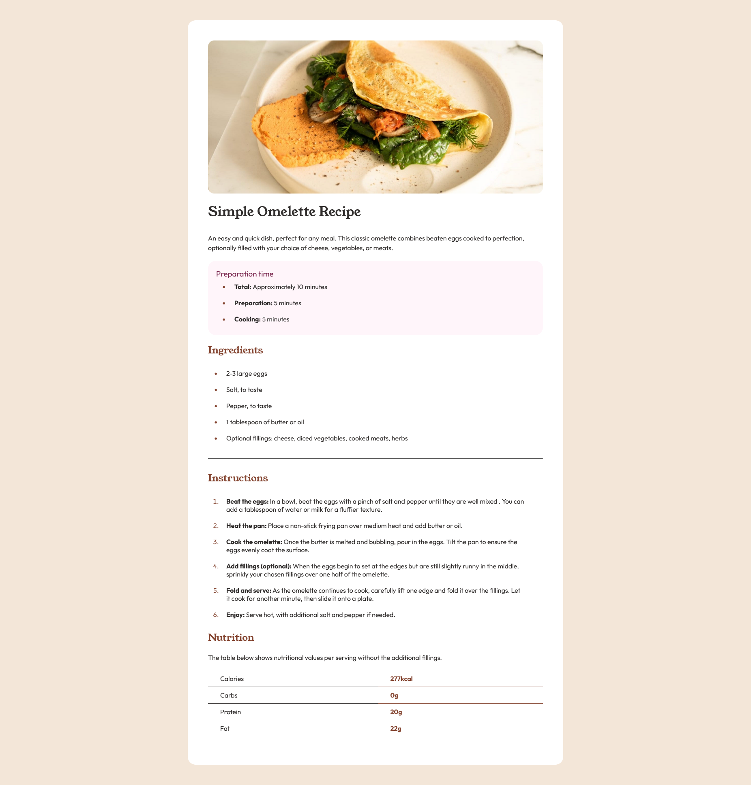
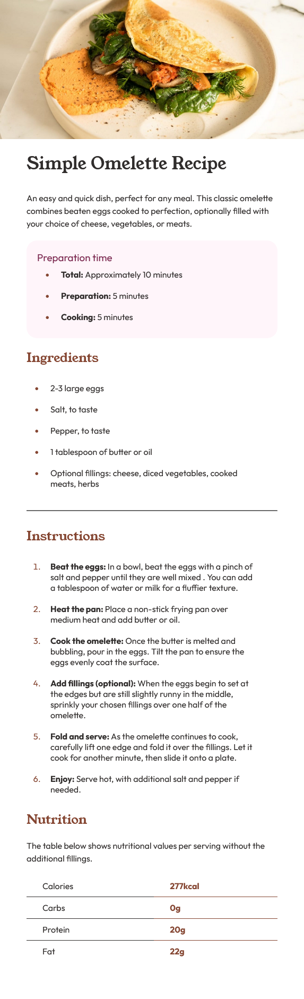

# Frontend Mentor - Recipe page solution

This is a solution to the [Recipe page challenge on Frontend Mentor](https://www.frontendmentor.io/challenges/recipe-page-KiTsR8QQKm). Frontend Mentor challenges help you improve your coding skills by building realistic projects.

## Table of contents

- [Overview](#overview)
  - [The challenge](#the-challenge)
  - [Screenshot](#screenshot)
  - [Links](#links)
- [My process](#my-process)
  - [Built with](#built-with)
  - [What I learned](#what-i-learned)
  - [Continued development](#continued-development)
  - [Useful resources](#useful-resources)
- [Author](#author)
- [Acknowledgments](#acknowledgments)

## Overview

### Screenshot

A

### Links

- Live Site URL: [site](https://nelsonmichelleweb.github.io/ferecipe/)

## My process

### Built with

- Semantic HTML5 markup
- CSS custom properties

### What I learned

I learned how to style a table, as I haven't done it before.

I got a refresher on media breakpoints, I struggled to get them to work for awhile though.

### Continued development

I would honestly like to work more on responsive design/media queries. I feel like I don't quite have a grasp on the concept.

### Useful resources

- [w3schools](https://www.w3schools.com/) - This has helped me understand almost anything, its the site I used to learn html and css.

## Author

- Frontend Mentor - [@nelsonmichelleweb](https://www.frontendmentor.io/profile/nelsonmichelleweb)

## Acknowledgments

N/A
